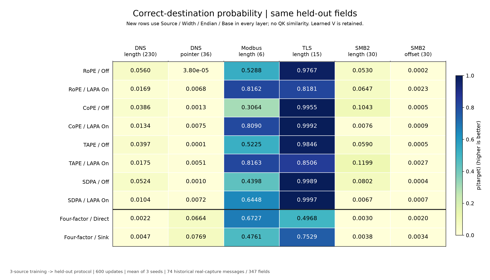

# LAPA Attention / X-Route — Research Archive

Research code for attention over byte-encoded length, offset, and pointer
relations. **Active development is paused; implementations and both positive
and negative results are preserved.** This describes the research status, not
GitHub's server-side read-only archive setting.

The current design **has not sufficiently established its central claim:
selecting the correct source and address operation on unseen protocols**.
This does not rule out every possible future LAPA design.
[Archive status and conclusions](docs/archive_status.md)

## Start here

| Purpose | Location |
| --- | --- |
| Runnable SDPA/RoPE/CoPE/TAPE × LAPA Off/On | [Package](src/lapa/), [examples](examples/) |
| Final four-factor experiment results | [v18 report](research_archive/studies/four_factor_attention_v18/REPORT.md), [tables](research_archive/studies/four_factor_attention_v18/TABLES.md) |
| Source/Width/Endian/Base formulas and losses | [v18 formulas](research_archive/studies/four_factor_attention_v18/FORMULAS.md) |
| v16 → v17 → v18 research history | [Research archive](research_archive/README.md) |
| Publication checks | [Release checklist](docs/release_checklist.md) |



The experiment uses real DNS, Modbus, TLS, and SMB2 data: **train on three
protocols and evaluate on the remaining one**, with three seeds and 600 updates.
The figure shows **correct-destination probability**, not F1. Higher DNS pointer
probability must not be interpreted as successful execution through the correct
source. The reports retain sample counts, NLL, Hit@1, source-contribution
analysis, and negative results.

The overview and maintenance documentation are in English. Historical study
records retain their original language and archived hashes.

## Implementation and reproduction scope

| Component | What it contains |
| --- | --- |
| `src/lapa` | Initial native-v4 compact bidirectional port. LAPA is fused into the final retrieval, not every encoder layer |
| v16 archive | Historical code, design, and results from the initial formula comparison |
| v17 archive | Historical code, design, and results from the expanded formula search |
| v18 archive | Direct source/width/endian/base combination instead of QK in every encoder layer and readout; no separate program head; V retained |

The research archive is a **historical snapshot that depends on the original
workspace and private datasets, contracts, and checkpoints**. Installing this
package does not reproduce all historical training runs. The initial package's
default joint loss also differs from the later comparisons' **Off = endpoint
NLL only** condition. Do not substitute default CLI results for v16–v18 results.

## Installation and data-free smoke checks

Python 3.10 or later is required. Dependency lower bounds are listed in
`pyproject.toml`; they are not a guarantee of compatibility with every version
combination. These checks do not require CUDA.

```bash
python -m venv .venv
source .venv/bin/activate
python -m pip install -e ".[plots]"
python -m unittest discover -s tests -t . -v
python examples/minimal_forward.py
python examples/compare_on_off.py
python examples/inspect_routing.py
```

The default examples use small, fixed numerical tensors to check **untrained
API behavior only**. They are not synthetic-protocol benchmarks or accuracy
experiments. Approved local data can be supplied explicitly:

```bash
python examples/compare_on_off.py --data data/native_v4/evaluation.jsonl --index 0
```

```python
import torch
from lapa import LapaConfig, LapaModel, ModelInputs

model = LapaModel(LapaConfig(attention="tape", lapa_enabled=True)).eval()
data = torch.arange(16, dtype=torch.long)[None, :]
inputs = ModelInputs(data, torch.ones_like(data, dtype=torch.bool), torch.tensor([0]))
with torch.no_grad():
    probabilities = model(inputs)["final"]
# API smoke input only; no performance metrics are computed.
```

## Data, weights, and publication contents

- Included on GitHub: source, configuration, tests, documentation,
  path-sanitized aggregate results, and Matplotlib figures and tables.
- Retained locally and excluded from tracking: raw packet-byte JSONL, DNS/x86
  tensors, PCAP files, weights, per-run predictions, original asset manifests,
  local verification/reference bundles, generated outputs, and environment files.
- The original real-data splits contain 3,089 training, 522 development, and
  74 evaluation messages, with 347 evaluation fields. **A GitHub clone does not
  include the datasets or weights.**
- See the [data guide](data/README.md) and
  [source notices](THIRD_PARTY_NOTICES.md) for access and permission boundaries.

Excluded originals and previous Git history are preserved in local-only
backups. The new public repository contains the sanitized snapshot;
**the previous private commit history is not published here**.
Public commits use a GitHub noreply address instead of a personal email.

## Pre-publication checks

```bash
python scripts/prepare_research_archive.py --verify
python scripts/check_release.py --report
git diff --check
git status --short
```

The checks cover tracked files and nonignored new files for raw assets, files
larger than 5 MiB, personal home paths, and selected credential/identifier
patterns. They do not replace a complete security, privacy, rights, or Git
history audit. Large aggregate JSON files are split without omitting numbers.

## License and attribution

Project-controlled code and documentation use [Apache-2.0](LICENSE).
Third-party notices are preserved in [NOTICE](NOTICE) and the
[license bundle](LICENSES/README.md). This does not grant redistribution rights
to raw data, weights, or material owned by others.

An official CoPE software license was not verified. The local equation-level
implementation is not presented as a distribution of official Meta code or
proof of separately obtained permission.

The public repository is
[kgwoLAB/lapa-attention](https://github.com/kgwoLAB/lapa-attention).
It remains a research archive without enabling GitHub's read-only archive
setting. Paper authorship and publication details require separate verification;
citation metadata is a draft.

[Architecture](docs/architecture.md) · [API](docs/api.md) ·
[Baseline fidelity](docs/baseline_fidelity.md) · [Reproduction](docs/reproduction.md) ·
[Work log](WORK_LOG.md)
